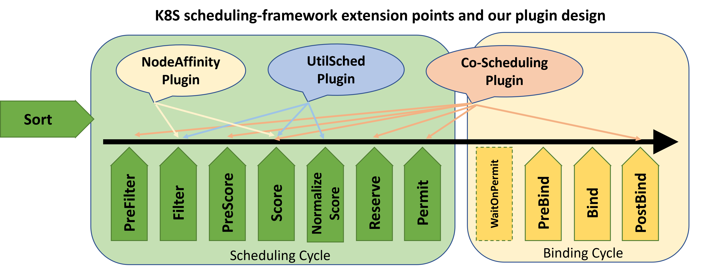

# UtilSched: A cluster `Util`ization driven K8S `Sched`uler 

utilSched is a kubernetes scheduler based on [scheduling-framework](https://github.com/kubernetes/enhancements/blob/master/keps/sig-scheduling/20180409-scheduling-framework.md). As a sub-project of [Alnair](https://github.com/CentaurusInfra/alnair), it can cooperate with [profilling](https://github.com/CentaurusInfra/alnair/tree/main/profiling) to schedule GPU tasks according to the current cluster utilization. 

The later version will also support: 
1) Cooperating with [elastic-training](https://github.com/CentaurusInfra/alnair/tree/main/elastic-training) to alleviate race conditions in a scale up/down process. 
2) Cooperating with [fine-grained-sharing](https://github.com/CentaurusInfra/alnair/tree/main/fine-grained-sharing) to schedule GPU tasks with granularity <= 1. 

### Diagram of K8S scheduling-framework and our design

----

## Quick Start
- Make sure kubernetes cluster version is `1.17+`
- Deploy UtilSched scheduler
- Check the scheduler status

## Deploy a Pod using UtilSched
## Develop from UtilSched
- Compile:
```shell
make local
```
- Build the docker image:
```shell
make build
```
- Clean the Build file
```shell
make clean
```


